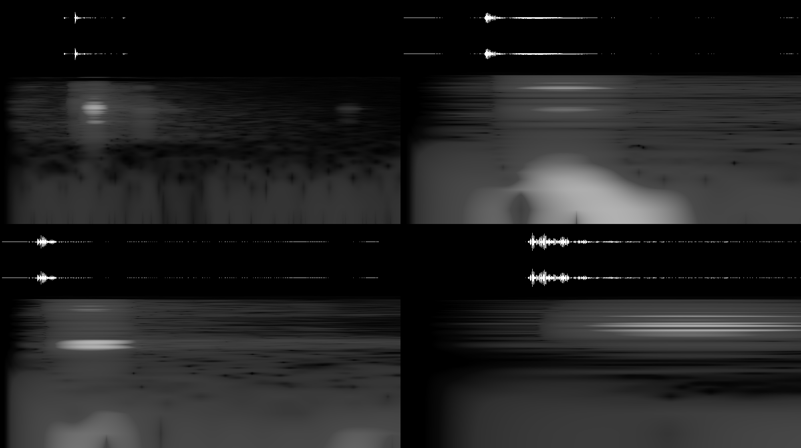

# Audio verification

Analysis date: 2026-10-05. Measured with FFmpeg waveform/spectrogram filters and decoded 16-bit PCM samples. This is signal inspection, not a listening evaluation; naturalness still needs human listening.

The original connect-2 and connect-3 WAV files contained only zeros. Their fade filters had run against the source timestamps before the output seek. Regeneration now trims first, resets timestamps, isolates a short transient, normalizes the peak, and applies short edge fades. The reproducible preparation script is `scripts/prepare-audio.py`; sources remain CC0 (see audio credits).

| Clip      | Decoded duration | Peak dBFS | RMS dBFS | Full-scale samples |
| --------- | ---------------- | --------- | -------- | ------------------ |
| lego-tap  | 177 ms           | -5.46     | -35.25   | 0                  |
| connect-1 | 60 ms            | -6.02     | -30.51   | 0                  |
| connect-2 | 70 ms            | -6.02     | -29.72   | 0                  |
| connect-3 | 40 ms            | -6.02     | -26.96   | 0                  |

Panels, left to right: impact / connect-1 on the top row; connect-2 / connect-3 on the bottom row. Each panel has stereo waveforms above its logarithmic frequency spectrogram; time runs left to right across the clip duration in the table. These are separate short broadband transients with decaying tails, not a ten-click loop. Peak levels have headroom and the connection clips end at zero.

Playback regressions are covered separately: a drop emits one impact and remains silent at rest; a later drop emits a new impact; a press and subsequent settling emit no impact; an intentional snap is not blocked by impact throttling. Automated WAV tests reject silent, full-scale, overlong, and abruptly terminated connection assets. The tests cannot guarantee perceived realism on every speaker.
